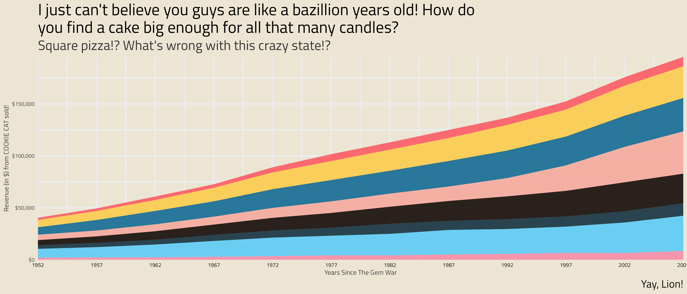

<!-- README.md is generated from README.Rmd. Please edit that file -->

```{r setup, include = FALSE}
knitr::opts_chunk$set(
  collapse = TRUE,
  comment = "#>",
  fig.path = "man/figures/README-",
  out.width = "70%",
  fig.align = "center"
)
```

# tvthemes 1.3.0 

<!-- badges: start -->
[](https://lifecycle.r-lib.org/articles/stages.html)
[](https://CRAN.R-project.org/package=tvthemes)
[](https://cran.r-project.org/package=tvthemes)
[](https://www.gnu.org/licenses/gpl-3.0)
[](https://app.codecov.io/gh/Ryo-N7/tvthemes?branch=master/)
[](https://github.com/Ryo-N7/tvthemes/actions)
[](https://ko-fi.com/O4O342A2A)
<!-- badges: end -->

[Ryo Nakagawara | Twitter: `@R_by_Ryo`](https://twitter.com/R_by_Ryo/)

The `tvthemes` package is a collection of various `ggplot2` themes and color/fill palettes based on everybody's favorite TV shows. What kick-started this whole package was my [blogpost](https://ryo-n7.github.io/2019-02-15-visualize-brooklyn-nine-nine/) looking at simple TV stats on my current favorite TV show, Brooklyn Nine-Nine. I got a lot of good feedback on the colors I used for the custom `ggplot2` theme and color palettes so I decided to expand it to other shows that I love! Suggestions and Pull Requests for palettes/themes are welcome!

* [Package Website](https://ryo-n7.github.io/tvthemes/)
* [Intro to `tvthemes 0.0.0.9100` blog post](https://ryo-n7.github.io/2019-05-16-introducing-tvthemes-package/)
* [`tvthemes 1.0.0` & CRAN release blog post](https://ryo-n7.github.io/2019-09-06-tvthemes-CRAN-announcement/)
* [`tvthemes 1.1.0` & CRAN release blog post](https://ryo-n7.github.io/2019-11-04-tvthemes-1.1.0-announcement/)
* [`tvthemes 1.3.0` & CRAN release blog post](https://ryo-n7.github.io/2022-03-17-tvthemes-1.3.0-announcement/)

```{r b99header, eval=FALSE}
library(tvthemes)
library(ggplot2)
library(extrafont)
loadfonts(quiet = TRUE)

ggplot(mpg, aes(displ)) +
  geom_histogram(aes(fill = class), 
                 col = "black", size = 0.1,
                 binwidth = 0.1) +
  scale_fill_brooklyn99(palette = "Dark") +
  labs(title = "Do you know what it means to 'clap back', Raymond?",
       subtitle = glue::glue("BE- {emo::ji('clap')} -CAUSE {emo::ji('clap')} I {emo::ji('clap')} DO {emo::ji('clap')} !"),
       x = "Titles of Your Sex Tape",
       caption = "Pizza bagels? Pizza rolls? Pizza poppers? Pizzaritos? Pizza pockets?") +
  theme_brooklyn99(title.font = "Titillium Web",
                   text.font = "Calibri Light",
                   subtitle.size = 14)
```


## Current list of TV shows

- __Avatar: The Last Airbender__: theme + palettes (Fire Nation, Water Tribe, Earth Kingdom, & Air Nomads)
- __Brooklyn Nine-Nine__: theme + palettes (regular & dark)
- __Game of Thrones/A Song of Ice & Fire__: 'The Palettes of Ice & Fire' (currently: Stark, Baratheon (Stannis), Lannister, Tully, Targaryen, Martell, Greyjoy, Tyrell, Arryn, Manderly)
- __Rick & Morty__: theme + palette
- __Parks & Recreation__: two themes (light & dark) + palette
- __The Simpsons__: theme + palette
- __Spongebob Squarepants__: theme + palette + background images
- __Hilda__: Day, Dusk, Night themes + palettes
- __Attack on Titan__: palette
- __Kim Possible__: palette
- __Big Hero 6__: palette
- __Gravity Falls__: palette
- __Steven Universe__: palette
- _More in future releases..._
- _Development branch_: TBD...

## Installation

You can install `tvthemes` by:

```{r, eval=FALSE}
## install.packages(devtools)
## for development version:
devtools::install_github("Ryo-N7/tvthemes")

## v1.3.0 is available on CRAN!
install.packages("tvthemes")
```

Now available on [CRAN](https://CRAN.R-project.org/package=tvthemes)!

## tvthemes 1.0.0 Major Changes

See [vignette](https://ryo-n7.github.io/tvthemes/articles/tvthemes-1_0_0.html).

## Fonts & Colors

See [vignette](https://ryo-n7.github.io/tvthemes/articles/fonts-and-colors.html).

# Examples

You can find the code for all the examples below in the ["Examples" Vignette](https://ryo-n7.github.io/tvthemes/articles/examples.html) on the [Package Website](https://ryo-n7.github.io/tvthemes/).

## Brooklyn Nine-Nine


## Spongebob Squarepants


## Game of Thrones: House Stark, Tully, Targaryen


## Game of Thrones: House Tyrell, Lannister, Greyjoy


## Game of Thrones: Arryn, Manderly, Martell


## Game of Thrones: Stannis Baratheon, The One True King


## The Simpsons


## Rick and Morty


## Avatar: The Last Airbender (Fire Nation, Air Nomads, Water Tribe, Earth Kingdom)


## Parks and Recreation


## Attack on Titan


## Kim Possible


## Big Hero 6


## Hilda


## Gravity Falls


## Steven Universe



# Contributing

Please note that the `tvthemes` project is released with a [Contributor Code of Conduct](https://github.com/Ryo-N7/tvthemes/blob/master/CODE_OF_CONDUCT.md). By contributing to this project, you agree to abide by its terms.

# License

This code is released under the GPL v3 License - see the
[LICENSE.md](https://github.com/Ryo-N7/tvthemes/blob/master/LICENSE.md) file for details.

# Credits

Inspired by [Matt Oldach](https://twitter.com/MattOldach/)'s [{vaporwave}](https://github.com/moldach/vapoRwave/), [Bob Rudis](https://twitter.com/hrbrmstr/)' [{hrbrthemes}](https://github.com/hrbrmstr/hrbrthemes/), [Garrick Aden-Buie](https://twitter.com/grrrck/)'s [{ggpomological}](https://github.com/gadenbuie/ggpomological/), [Ewen Henderson](https://twitter.com/ewen_/)'s [{ghibli}](https://github.com/ewenme/ghibli/), [rOpenSci](https://github.com/ropenscilabs/)'s [{ochRe}](https://github.com/hollylkirk/ochRe), & [Nathan Cunningham](http://www.nathancunn.com/2017-07-16-simpsons-characters/).

Hilda palettes from [Matt Shanks](https://www.mattshanks.com.au/colour-palette-reference-hilda/) and [ChevyRay](https://imgur.com/a/6oY8c6k).

["Some Time Later" font](https://github.com/ctrlcctrlv/some-time-later) courtesy of Frederick Brennan.
