<!-- README.md is generated from README.Rmd. Please edit that file -->

# tvthemes 

<!-- badges: start -->

[](https://www.tidyverse.org/lifecycle/#experimental)
[](https://www.gnu.org/licenses/gpl-3.0)
[](https://codecov.io/gh/Ryo-N7/tvthemes?branch=master)
<!-- badges: end -->

[Ryo Nakagawara | Twitter: `@R_by_Ryo`](https://twitter.com/R_by_Ryo)

The `tvthemes` package is a collection of various `ggplot2` themes and
color/fill palettes based on everybody’s favorite TV shows. What
kick-started this whole package was my
[blogpost](https://ryo-n7.github.io/2019-02-15-visualize-brooklyn-nine-nine/)
looking at simple TV stats on my current favorite TV show, Brooklyn
Nine-Nine. I got a lot of good feedback on the colors I used for the
custom `ggplot2` theme and color palettes so I decided to expand it to
other shows that I love\! You can also learn about `tvthemes` from the
introductory blog post on my website,
[here](https://ryo-n7.github.io/2019-05-16-introducing-tvthemes-package/).

Suggestions and Pull Requests for palettes/themes are welcome\!

``` r
mpg %>% 
  ggplot(aes(displ)) +
  geom_histogram(aes(fill = class), 
                 col = "black", size = 0.1,
                 binwidth = 0.1) +
  scale_fill_brooklyn99_dark() +
  labs(title = "Do you know what it means to 'clap back', Raymond?",
       subtitle = glue::glue("BE- {emo::ji('clap')} -CAUSE {emo::ji('clap')} I {emo::ji('clap')} DO {emo::ji('clap')} !"),
       caption = "Pizza bagels? Pizza rolls? Pizza poppers? Pizzaritos? Pizza pockets?") +
  theme_brooklyn99(title.font = "Titillium Web",
                   text.font = "Calibri Light",
                   subtitle.size = 14)
```

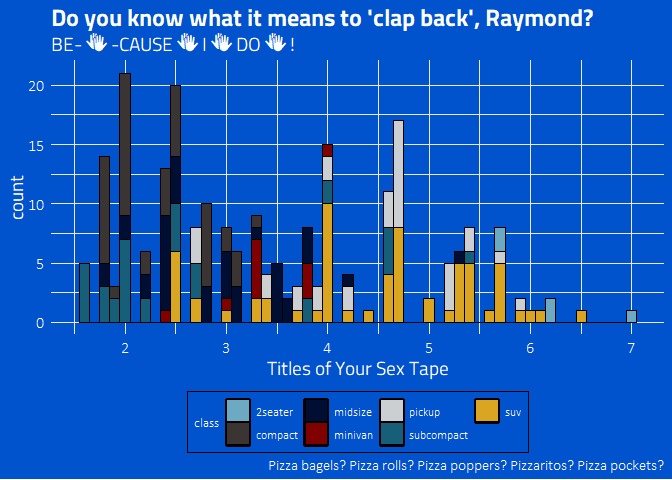

## Current list of TV shows

  - **Avatar: The Last Airbender**: theme + palettes (Fire Nation, Water
    Tribe, Earth Kingdom, & Air Nomads)
  - **Brooklyn Nine-Nine**: theme + palettes (regular & dark)
  - **Game of Thrones/A Song of Ice & Fire**: ‘The Palettes of Ice &
    Fire’ (currently: Stark, Lannister, Tully, Targaryen, Greyjoy, &
    Tyrell)
  - **Rick & Morty**: theme + palette
  - **Parks & Recreation**: two themes (light & dark) + palette
  - **The Simpsons**: theme + palette
  - **Spongebob Squarepants**: theme + palette + background images
  - *More in future releases…*
  - *Development branch*: House Dayne, House Manderly, Attack on Titan,
    Kim Possible

## Installation

`tvthemes` is currently available only on Github, you can install it by:

``` r
## install.packages(devtools)
devtools::install_github("Ryo-N7/tvthemes")
```

I hope to have a CRAN version soon\!

## Fonts

The difficulty with a lot of the fonts used by TV shows in their logos
and other paraphernalia is that they are made by font foundries and
therefore can be rather expensive (for a regular person like you or me)
to purchase. So I endeavored to find FREE fonts to use that were
somewhat similar to the real ones used by the shows from resources like
`Google Fonts`. In the documentation you can find the **actual** fonts
used by the TV shows if you are so inclined to buy them (some are just
my best guesses though)\! In some cases there were fan-made fonts such
as “Some Time Later” for Spongebob or “Akbar” for The Simpsons that I
included with the package.

Instead of dealing with `extrafont` yourself, I re-purposed the
`import_*()` functions from the `hrbrthemes` package so you can import
the included fonts very easily. Do note that you still might need to
install the fonts directly on your computer from the `.ttf` files found
in `inst/fonts`. When you’re done running the functions and installing
the `.ttf` files on your computer, load the `extrafont` library and then
run `loadfonts()`. If you’re having problems check out the documentation
on `extrafont`’s [Github repo](https://github.com/wch/extrafont) or on
[CRAN](https://cran.r-project.org/web/packages/extrafont/index.html).

The help files for each function tells you the recommended font names in
case you forget\! Besides the really custom stuff like for “The
Simpsons”, “Rick & Morty”, and “SpongeBob”, font preferences are
really up to you.

``` r
import_simpsons()         ## "Akbar" font
import_theLastAirbender() ## "Slayer" font
import_rickAndMorty()     ## "Get Schwifty" font
import_roboto_condensed() ## "Roboto Condensed" Google Font import from hrbrthemes
import_titillium_web()    ## "Titillium Web" Google Font import from hrbrthemes
import_spongeBob()        ## "Some Time Later" font
import_cinzel()           ## "Cinzel" font to use with 'The Palettes of Ice & Fire'

## install.packages("extrafont")
library(extrafont)
loadfonts() ## You need to do this at the beginning of a session.
```

## Colors

I gathered the colors/hex codes by looking at images online or
re-watching some old episodes and then using various hex code websites
and hex code extraction websites. The colors in some of these palettes
may still change from feedback and further experimentation.

You can check out all the colors for each palette by running
`scales::show_col(tvthemes:::name_of_palette)`. Some examples
below:

``` r
scales::show_col(tvthemes:::brooklyn99_dark_palette)
```

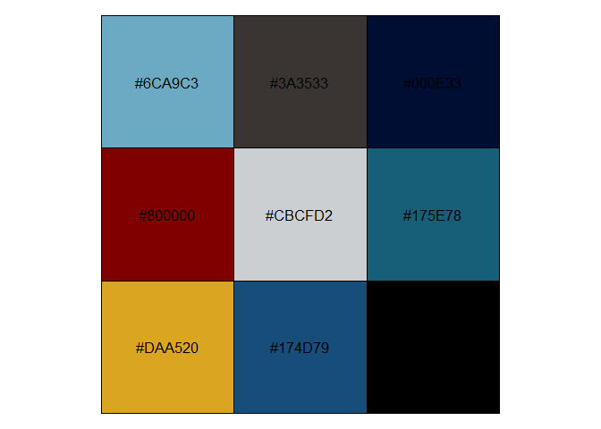

``` r
scales::show_col(tvthemes:::lannister_palette)
```

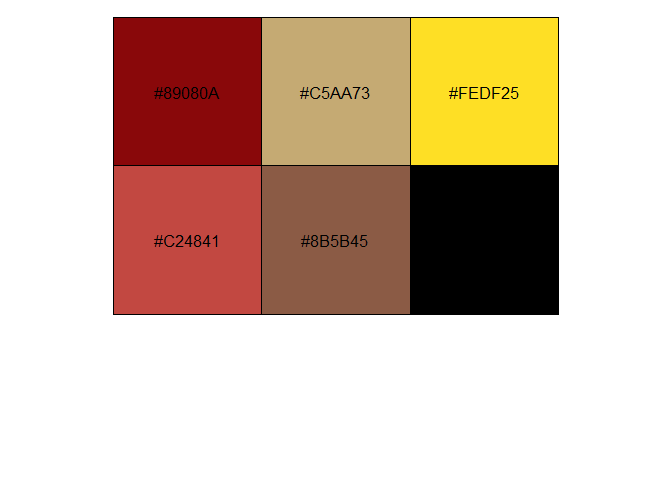

``` r
scales::show_col(tvthemes:::simpsons_palette)
```


## Examples

### Brooklyn Nine-Nine

``` r
mpg %>% 
  ggplot(aes(displ)) +
  geom_histogram(aes(fill = class), col = "black", size = 0.1) +
  scale_fill_brooklyn99() +
  labs(title = "Captain Wuntch. Good to see you.",
       subtitle = "But if you're here, who's guarding Hades?",
       caption = "Terry LOVES ggplot2!") +
  theme_brooklyn99(text.font = "Calibri Light",
                   title.font = "Roboto Condensed", 
                   legend.font = "Calibri Light")
```

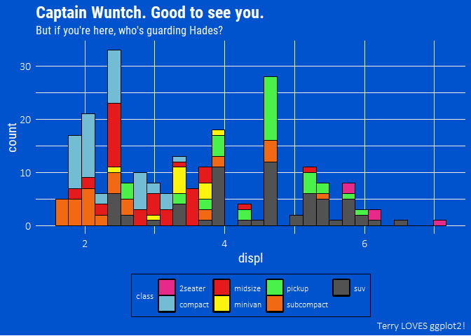

### Spongebob Squarepants

``` r
bobspog_plot <- mpg %>% 
  ggplot(aes(displ)) +
  geom_histogram(aes(fill = class), col = "black", size = 0.1) +
  scale_fill_spongeBob() +
  labs(title = "F is for Fire that burns down the whole town!",
       subtitle = "U is for Uranium... bombs! N is for No survivors when you're-",
       caption = "Plankton, those things aren't what fun is about!") +
  theme_spongeBob(title.font = "Some Time Later",
                  text.font = "Some Time Later",
                  title.size = 22,
                  subtitle.size = 16,
                  axis.title.size = 16,
                  axis.text.size = 14,
                  legend.title.size = 14)

bobspog_plot
```

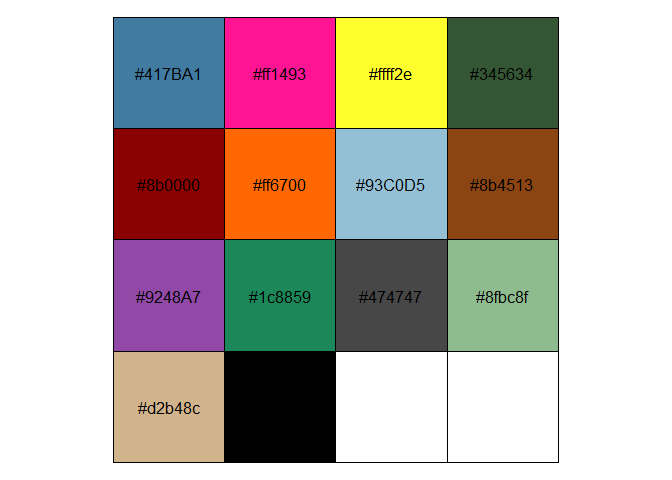

``` r

## use a themed background! Inspired by ggpomological::paint_pomological()!
paintBikiniBottom(plot = bobspog_plot,
                  background = "background") 
```

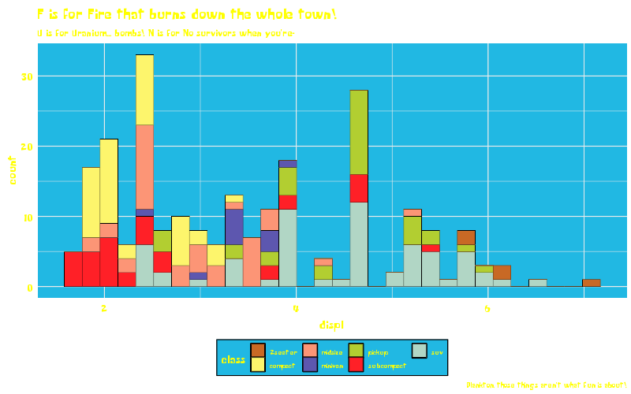

### Game of Thrones: House Stark, Lannister, Targaryen

``` r
mpg %>% 
  ggplot(aes(displ)) +
  geom_histogram(aes(fill = class), col = "black", size = 0.1) +
  labs(title = "The winters are hard, but the Starks will endure.",
       subtitle = "We always have...",
       caption = "Winter Is Coming...") +
  scale_y_continuous(expand = c(0,0)) +
  scale_x_continuous(expand = c(0,0)) +
  scale_fill_stark() +
  theme_minimal() +
  theme(text = element_text(family = "Cinzel", size = 14)) -> stark

colstully <- tully_pal()(5)

ggplot(diamonds, aes(price, fill = cut)) +
  geom_histogram(binwidth = 500) +
  scale_fill_manual(values = rev(colstully)) +
  #scale_fill_tully() +
  labs(title = "I've seen wet shits I like better than Walder Frey.",
       subtitle = "Pardon my lord, my lady. I need to find a tree to piss on.",
       caption = "- The Blackfish") +
  theme_minimal() +
  theme(text = element_text(family = "Cinzel", size = 10),
        title = element_text(family = "Cinzel", size = 14)) -> tully

ggplot(gapminder::gapminder, aes(x = log10(gdpPercap), y = lifeExp)) +
  geom_point(aes(color = continent)) + 
  scale_x_log10() +
  scale_color_targaryen() +
  labs(title = "I am the blood of the dragon. I must be strong.",
       subtitle = "I must have fire in my eyes when I face them, not tears.",
       caption = "- Fire & Blood.") +
  theme_minimal() +
  theme(text = element_text(family = "Cinzel", size = 10),
        title = element_text(family = "Cinzel", size = 14)) -> targaryen

## patchwork together:
stark + tully - targaryen + plot_layout(ncol = 1)
```

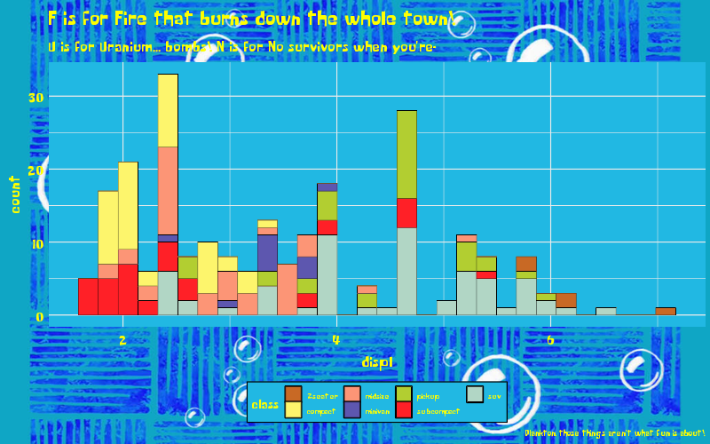

### Game of Thrones: House Tyrell, Tully, Greyjoy

``` r
data <- gapminder::gapminder %>% 
  filter(country %in% c("France", "Germany", "Ireland", "Italy", "Japan", "Norway", "Belarus")) %>% 
  mutate(year = as.Date(paste(year, "-01-01", sep = "", format = '%Y-%b-%d')))

ggplot(data = data, aes(x = year, y = gdpPercap, fill = country)) +
  geom_area(alpha = 0.8) +
  scale_x_date(breaks = data$year, date_labels = "%Y") +
  scale_y_continuous(expand = c(0, 0), labels = scales::dollar) +
  scale_fill_tyrell() +
  labs(title = "All men are fools, if truth be told, but",
       subtitle = "the ones in motley are more amusing than ones with crowns.",
       caption = "- The Queen of Thorns") +
  theme_minimal() +
  theme(text = element_text(family = "Cinzel", size = 10),
        plot.title = element_text(family = "Cinzel", size = 16),
        plot.subtitle = element_text(family = "Cinzel", size = 12)) -> tyrell

cols <- lannister_pal()(5)

ggplot(diamonds, aes(price, fill = cut)) +
  geom_histogram(binwidth = 500) +
  labs(title = "You are done with whores.",
       subtitle = "The next one I find in your bed, I'll hang.",
       caption = "Rains of Castamere") +
  scale_fill_manual(values = rev(cols)) +
  #scale_fill_lannister() +
  theme_minimal() +
  theme(text = element_text(family = "Cinzel", size = 14)) -> lannister

airquality %>% 
  mutate(Month = as.factor(Month)) %>% 
  ggplot(aes(x = Day, y = Temp, group = Month, color = Month)) +
  geom_line(size = 1.5) +
  scale_color_greyjoy() +
  labs(title = "I am the storm, my lord.",
       subtitle = "The first storm, and the last.",
       caption = "- Euron 'The Crow's Eye' Greyjoy") +
  theme_minimal() +
  theme(text = element_text(family = "Cinzel", size = 10),
        title = element_text(family = "Cinzel", size = 14)) -> greyjoy

## patchwork together:
tyrell + lannister - greyjoy + plot_layout(ncol = 1)
```

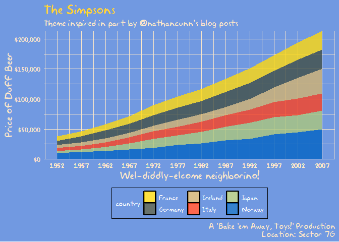

### The Simpsons

``` r
data <- gapminder::gapminder %>% 
  filter(country %in% c("France", "Germany", "Ireland", "Italy", "Japan", "Norway", "Belarus")) %>% 
  mutate(year = as.Date(paste(year, "-01-01", sep = "", format='%Y-%b-%d')))

ggplot(data = data, aes(x = year, y = gdpPercap, fill = country)) +
  geom_area(alpha = 0.8) +
  scale_x_date(breaks = data$year, date_labels = "%Y") +
  scale_y_continuous(expand = c(0, 0), labels = scales::dollar) +
  scale_fill_simpsons() +
  labs(title = "The Simpsons",
       subtitle = "Theme inspired in part by @nathancunn's blog posts",
       caption = glue::glue("
                      A 'Bake 'em Away, Toys!' Production
                      Location: Sector 7G"),
       x = "Wel-diddly-elcome neighborino!",
       y = "Price of Duff Beer") +
  theme_simpsons(title.font = "Akbar",
                 text.font = "Akbar",
                 axis.text.size = 8)
```

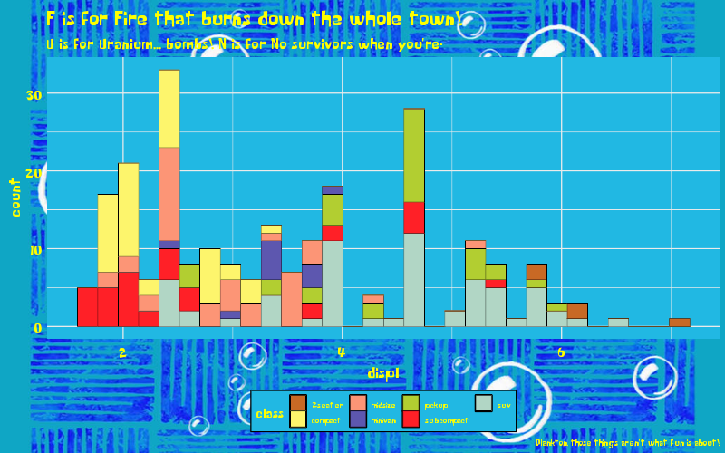

### Rick and Morty

``` r
ggplot(diamonds, aes(price, fill = cut)) +
  geom_histogram(binwidth = 500) +
  scale_fill_rickAndMorty() +
  labs(title = "Dammit Morty, You Know Diamonds Aren't Forever Right?",
       subtitle = "They're blood diamonds, Morty **burp**",
       caption = "Wubbalubbadubdub!") +
  theme_rickAndMorty(title.font = "Get Schwifty",
                     text.font = "Get Schwifty",
                     title.size = 14)
```

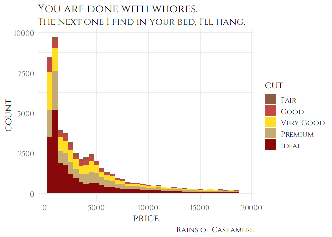

### Avatar: The Last Airbender (Fire Nation, Air Nomads, Water Tribe, Earth Kingdom)

``` r
mpg %>% 
  ggplot(aes(displ)) +
  geom_histogram(aes(fill = class), col = "black", size = 0.1) +
  scale_fill_fireNation() +
  labs(title = "Flameo, Hotman!",
       subtitle = "Fire. Wang Fire. This is my wife, Sapphire.",
       x = "Lion Vultures Owned",
       y = "Agni Kai Participation") +
  theme_theLastAirbender(title.font = "Slayer",
                         text.font = "Slayer") -> firenation

airquality %>% 
  mutate(Month = as.factor(Month)) %>% 
  ggplot(aes(x = Day, y = Temp, group = Month, color = Month)) +
  geom_line(size = 1.5) +
  scale_color_airNomads() +
  labs(title = "Let's head to the Eastern Air Temple!",
       subtitle = "Appa, Yip Yip!") +
  theme_theLastAirbender(title.font = "Slayer",
                         text.font = "Slayer",
                         title.size = 10) -> airnomads

ggplot(gapminder::gapminder, aes(x = log10(gdpPercap), y = lifeExp)) +
  geom_point(aes(color = continent)) + 
  scale_x_log10() +
  scale_color_waterTribe() +
  labs(title = "I am thinking maybe we could... do an activity together?",
       subtitle = "... Do an activity?",
       x = "GDP per Otter-Penguins",
       y = "Life Expectancy of Arctic Camels") +
  theme_theLastAirbender(title.font = "Slayer",
                         text.font = "Slayer",
                         title.size = 8,
                         subtitle.size = 8) -> watertribe

mpg %>% 
  ggplot(aes(displ)) +
  geom_histogram(aes(fill = class), col = "black", size = 0.1) +
  scale_fill_earthKingdom() +
  labs(title = "There is no war in Ba Sing Se",
       subtitle = "(Welcome to Lake Laogai)") +
  theme_theLastAirbender(title.font = "Slayer",
                         text.font = "Slayer",
                         title.size = 14) -> earthkingdom

## plot together:
plot_grid(firenation, airnomads, watertribe, earthkingdom, ncol = 2)
```

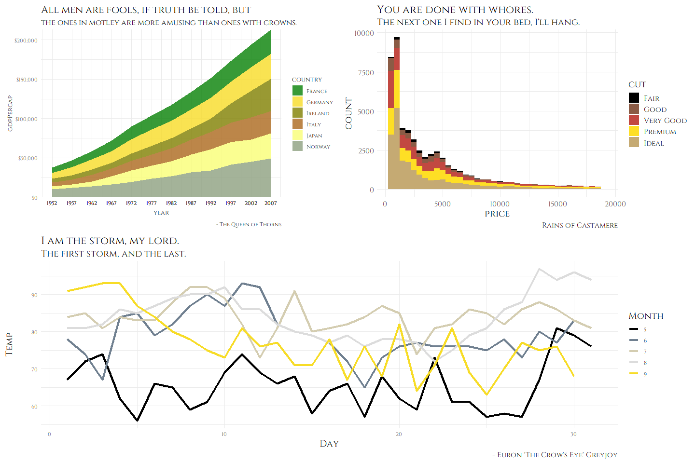

### Parks and Recreation

``` r
airquality %>% 
  mutate(Month = as.factor(Month)) %>% 
  ggplot(aes(x = Day, y = Temp, group = Month, color = Month)) +
  geom_point(size = 2.5) +
  labs(title = "Calzones are pointless.", subtitle = "They're just pizza that's harder to eat!",
       caption = "No one likes them. Good day, sir.") + 
  scale_color_parksAndRec() + 
  theme_minimal() +
  theme_parksAndRec(text.font = "Titillium Web",
                    title.font = "Titillium Web Black",
                    legend.font = "Titillium Web") -> parksandrec

mpg %>% 
  ggplot(aes(displ)) +
  geom_histogram(aes(fill = class), col = "black", size = 0.1) +
  labs(title = "Parks & Recreation",
       subtitle = "Gotta Spend Money To Make Money!",
       caption = "And I spent... all of my money!") +
  scale_fill_parksAndRec() + 
  theme_minimal() +
  theme_parksAndRec_light(title.font = "Titillium Web Black",
                    text.font = "Titillium Web") -> parksandreclight

## plot together:
plot_grid(parksandrec, parksandreclight, ncol = 2)
```

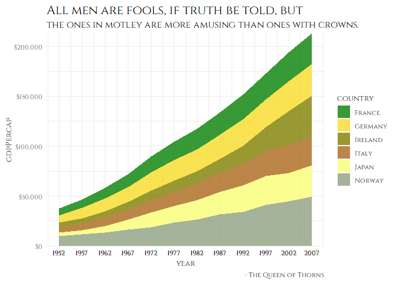

## Contributing

Please note that the `tvthemes` project is released with a [Contributor
Code of Conduct](CODE_OF_CONDUCT.md). By contributing to this project,
you agree to abide by its terms.

## License

This code is released under the GPL v3 License - see the
[LICENSE.md](LICENSE.md) file for details.
