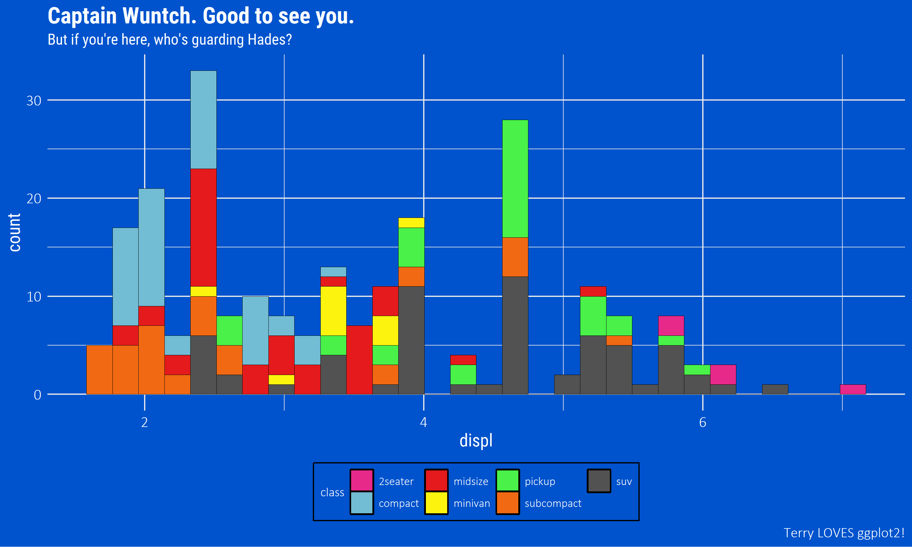
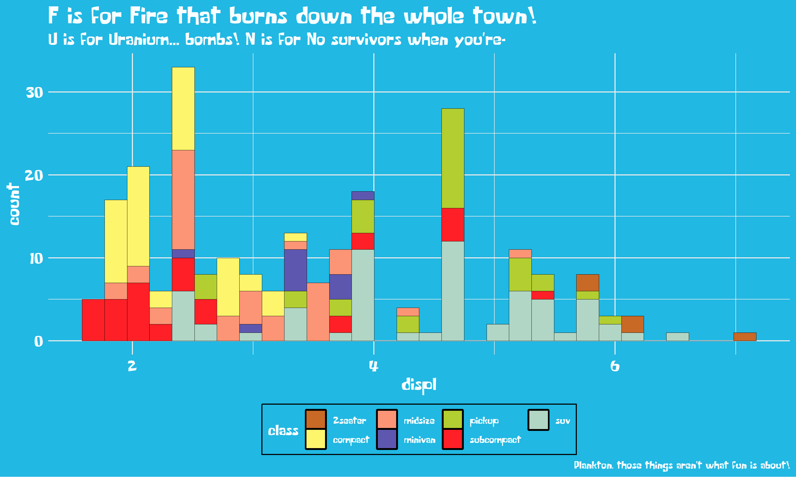
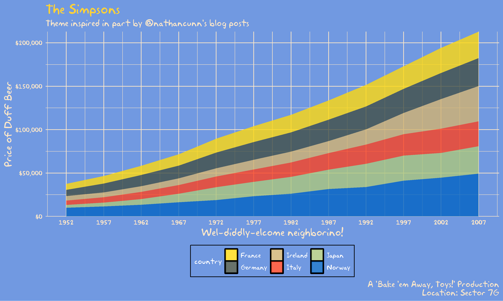
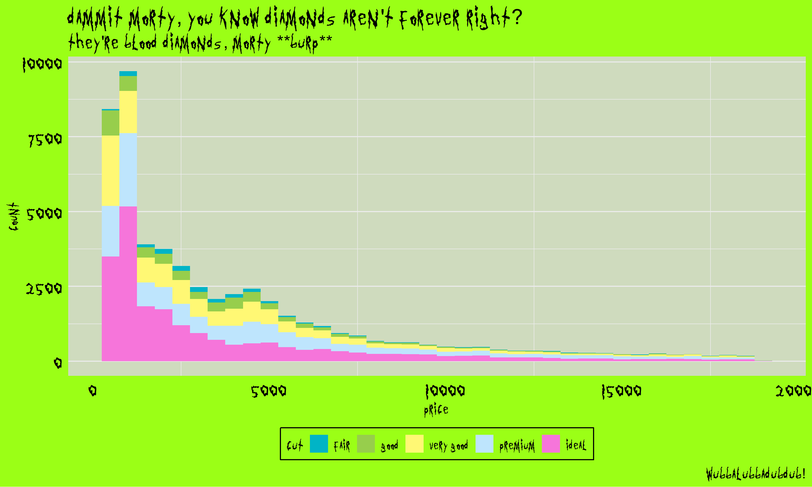

<!-- README.md is generated from README.Rmd. Please edit that file -->

# tvthemes 1.3.1 

<!-- badges: start -->

[](https://lifecycle.r-lib.org/articles/stages.html)
[](https://CRAN.R-project.org/package=tvthemes)
[](https://cran.r-project.org/package=tvthemes)
[](https://www.gnu.org/licenses/gpl-3.0)
[](https://app.codecov.io/gh/Ryo-N7/tvthemes?branch=master/)
[](https://github.com/Ryo-N7/tvthemes/actions)
[](https://ko-fi.com/O4O342A2A)
<!-- badges: end -->

Ryo Nakagawara \| Twitter: `@R_by_Ryo`

The `tvthemes` package is a collection of various `ggplot2` themes and
color/fill palettes based on everybody’s favorite TV shows. What
kick-started this whole package was my
[blogpost](https://ryo-n7.github.io/2019-02-15-visualize-brooklyn-nine-nine/)
looking at simple TV stats on my current favorite TV show, Brooklyn
Nine-Nine. I got a lot of good feedback on the colors I used for the
custom `ggplot2` theme and color palettes so I decided to expand it to
other shows that I love! Suggestions and Pull Requests for
palettes/themes are welcome!

- [Package Website](https://ryo-n7.github.io/tvthemes/)
- [Intro to `tvthemes 0.0.0.9100` blog
  post](https://ryo-n7.github.io/2019-05-16-introducing-tvthemes-package/)
- [`tvthemes 1.0.0` & CRAN release blog
  post](https://ryo-n7.github.io/2019-09-06-tvthemes-CRAN-announcement/)
- [`tvthemes 1.1.0` & CRAN release blog
  post](https://ryo-n7.github.io/2019-11-04-tvthemes-1.1.0-announcement/)
- [`tvthemes 1.3.0` & CRAN release blog
  post](https://ryo-n7.github.io/2022-03-17-tvthemes-1.3.0-announcement/)

``` r
library(tvthemes)
library(ggplot2)
library(extrafont)
loadfonts(quiet = TRUE)

ggplot(mpg, aes(displ)) +
  geom_histogram(aes(fill = class), 
                 col = "black", size = 0.1,
                 binwidth = 0.1) +
  scale_fill_brooklyn99(palette = "Dark") +
  labs(title = "Do you know what it means to 'clap back', Raymond?",
       subtitle = glue::glue("BE- {emo::ji('clap')} -CAUSE {emo::ji('clap')} I {emo::ji('clap')} DO {emo::ji('clap')} !"),
       x = "Titles of Your Sex Tape",
       caption = "Pizza bagels? Pizza rolls? Pizza poppers? Pizzaritos? Pizza pockets?") +
  theme_brooklyn99(title.font = "Titillium Web",
                   text.font = "Calibri Light",
                   subtitle.size = 14)
```


## Current list of TV shows

- **Avatar: The Last Airbender**: theme + palettes (Fire Nation, Water
  Tribe, Earth Kingdom, & Air Nomads)
- **Brooklyn Nine-Nine**: theme + palettes (regular & dark)
- **Game of Thrones/A Song of Ice & Fire**: ‘The Palettes of Ice & Fire’
  (currently: Stark, Baratheon (Stannis), Lannister, Tully, Targaryen,
  Martell, Greyjoy, Tyrell, Arryn, Manderly)
- **Rick & Morty**: theme + palette
- **Parks & Recreation**: two themes (light & dark) + palette
- **The Simpsons**: theme + palette
- **Spongebob Squarepants**: theme + palette + background images
- **Hilda**: Day, Dusk, Night themes + palettes
- **Attack on Titan**: palette
- **Kim Possible**: palette
- **Big Hero 6**: palette
- **Gravity Falls**: palette
- **Steven Universe**: palette
- *More in future releases…*
- *Development branch*: TBD…

## Installation

You can install `tvthemes` by:

``` r
## install.packages(devtools)
## for development version:
devtools::install_github("Ryo-N7/tvthemes")

## v1.3.0 is available on CRAN!
install.packages("tvthemes")
```

Now available on [CRAN](https://CRAN.R-project.org/package=tvthemes)!

## tvthemes 1.0.0 Major Changes

See
[vignette](https://ryo-n7.github.io/tvthemes/articles/tvthemes-1_0_0.html).

## Fonts & Colors

See
[vignette](https://ryo-n7.github.io/tvthemes/articles/fonts-and-colors.html).

# Examples

You can find the code for all the examples below in the [“Examples”
Vignette](https://ryo-n7.github.io/tvthemes/articles/examples.html) on
the [Package Website](https://ryo-n7.github.io/tvthemes/).

## Brooklyn Nine-Nine

<figure>

<figcaption aria-hidden="true">b99d</figcaption>
</figure>

<figure>

<figcaption aria-hidden="true">b99l</figcaption>
</figure>

## Spongebob Squarepants

<figure>

<figcaption aria-hidden="true">bobspog</figcaption>
</figure>

<figure>

<figcaption aria-hidden="true">bobspogbkg</figcaption>
</figure>

## Game of Thrones: House Stark, Tully, Targaryen

<figure>

<figcaption aria-hidden="true">StarkTullyTargaryen</figcaption>
</figure>

## Game of Thrones: House Tyrell, Lannister, Greyjoy

<figure>

<figcaption aria-hidden="true">TyrellLannisterGreyjoy</figcaption>
</figure>

## Game of Thrones: Arryn, Manderly, Martell

<figure>

<figcaption aria-hidden="true">ArrynManderlyMartell</figcaption>
</figure>

## Game of Thrones: Stannis Baratheon, The One True King

<figure>

<figcaption aria-hidden="true">stannis</figcaption>
</figure>

## The Simpsons

<figure>

<figcaption aria-hidden="true">simpsons</figcaption>
</figure>

## Rick and Morty

<figure>

<figcaption aria-hidden="true">randm</figcaption>
</figure>

## Avatar: The Last Airbender (Fire Nation, Air Nomads, Water Tribe, Earth Kingdom)

<figure>

<figcaption aria-hidden="true">tla</figcaption>
</figure>

## Parks and Recreation

<figure>

<figcaption aria-hidden="true">pandr</figcaption>
</figure>

## Attack on Titan

<figure>

<figcaption aria-hidden="true">aot</figcaption>
</figure>

## Kim Possible

<figure>

<figcaption aria-hidden="true">KimPossible</figcaption>
</figure>

## Big Hero 6

<figure>

<figcaption aria-hidden="true">bighero6</figcaption>
</figure>

## Hilda

<figure>

<figcaption aria-hidden="true">hilda</figcaption>
</figure>

## Gravity Falls

<figure>

<figcaption aria-hidden="true">gravityfall</figcaption>
</figure>

## Steven Universe

<figure>

<figcaption aria-hidden="true">stevenuniverse</figcaption>
</figure>

# Contributing

Please note that the `tvthemes` project is released with a [Contributor
Code of
Conduct](https://github.com/Ryo-N7/tvthemes/blob/master/CODE_OF_CONDUCT.md).
By contributing to this project, you agree to abide by its terms.

# License

This code is released under the GPL v3 License - see the
[LICENSE.md](https://github.com/Ryo-N7/tvthemes/blob/master/LICENSE.md)
file for details.

# Credits

Inspired by Matt Oldach’s
[{vaporwave}](https://github.com/moldach/vapoRwave/), Bob Rudis’
[{hrbrthemes}](https://github.com/hrbrmstr/hrbrthemes/), Garrick
Aden-Buie’s
[{ggpomological}](https://github.com/gadenbuie/ggpomological/), Ewen
Henderson’s [{ghibli}](https://github.com/ewenme/ghibli/),
[rOpenSci](https://github.com/ropenscilabs/)’s
[{ochRe}](https://github.com/hollylkirk/ochRe), & [Nathan
Cunningham](http://www.nathancunn.com/2017-07-16-simpsons-characters/).

Hilda palettes from [Matt
Shanks](https://www.mattshanks.com.au/colour-palette-reference-hilda/)
and [ChevyRay](https://imgur.com/a/6oY8c6k).

[“Some Time Later” font](https://github.com/ctrlcctrlv/some-time-later)
courtesy of Frederick Brennan.
